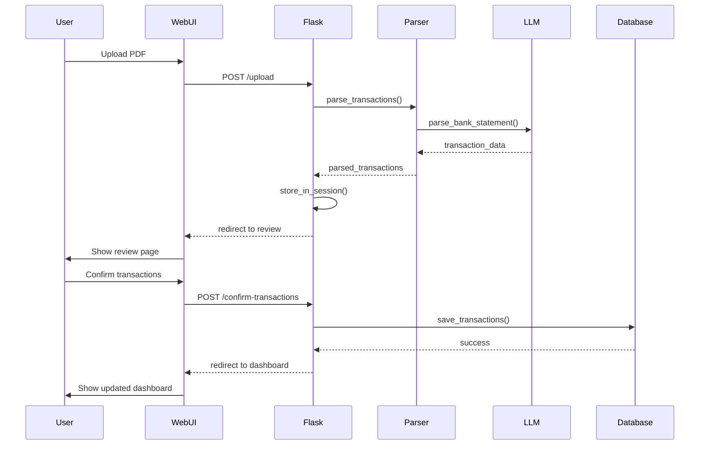
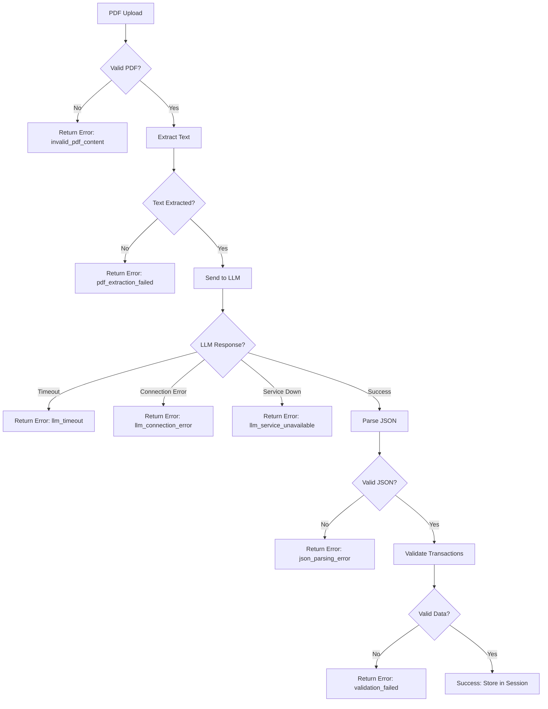
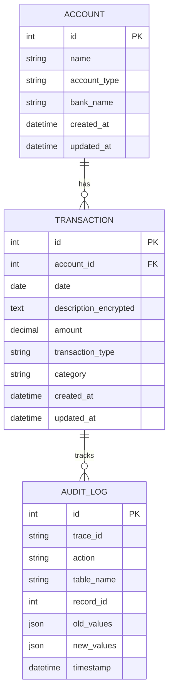
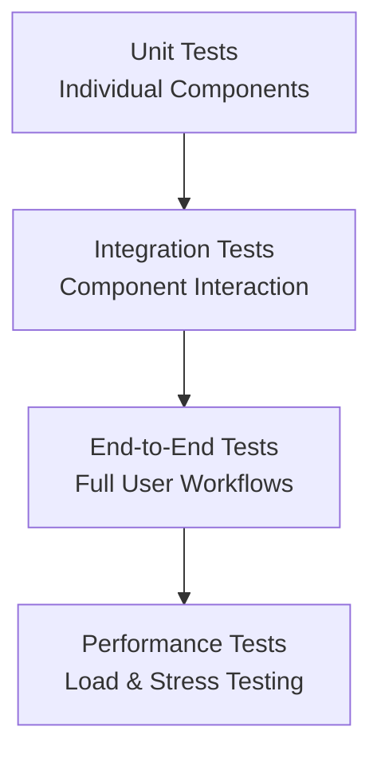

# Technical Documentation - Personal Finance Dashboard

## Table of Contents

1. [System Architecture](#system-architecture)
2. [Data Flow](#data-flow)
3. [Component Details](#component-details)
4. [Database Schema](#database-schema)
5. [LLM Integration](#llm-integration)
6. [Security Implementation](#security-implementation)
7. [Error Handling](#error-handling)
8. [Performance Considerations](#performance-considerations)
9. [Testing Strategy](#testing-strategy)
10. [Deployment Architecture](#deployment-architecture)

## System Architecture

### High-Level Architecture

The Personal Finance Dashboard follows a layered architecture pattern with clear separation of concerns:

```
┌─────────────────────────────────────────────────────────────┐
│                    Presentation Layer                        │
│  ┌─────────────┐  ┌─────────────┐  ┌─────────────────────┐  │
│  │   Web UI    │  │  REST API   │  │   Static Assets     │  │
│  │ (Bootstrap) │  │ (Flask)     │  │   (CSS/JS)          │  │
│  └─────────────┘  └─────────────┘  └─────────────────────┘  │
└─────────────────────────────────────────────────────────────┘
                              │
┌─────────────────────────────────────────────────────────────┐
│                    Business Logic Layer                      │
│  ┌─────────────┐  ┌─────────────┐  ┌─────────────────────┐  │
│  │  Parsers    │  │ LLM Service │  │  Session Mgmt       │  │
│  │ (Universal) │  │ (Ollama)    │  │  (Upload Review)    │  │
│  └─────────────┘  └─────────────┘  └─────────────────────┘  │
└─────────────────────────────────────────────────────────────┘
                              │
┌─────────────────────────────────────────────────────────────┐
│                    Data Access Layer                         │
│  ┌─────────────┐  ┌─────────────┐  ┌─────────────────────┐  │
│  │ SQLAlchemy  │  │ Encryption  │  │   Audit Logging     │  │
│  │  Models     │  │  Service    │  │   (Trace IDs)       │  │
│  └─────────────┘  └─────────────┘  └─────────────────────┘  │
└─────────────────────────────────────────────────────────────┘
                              │
┌─────────────────────────────────────────────────────────────┐
│                    Infrastructure Layer                      │
│  ┌─────────────┐  ┌─────────────┐  ┌─────────────────────┐  │
│  │ PostgreSQL  │  │   Docker    │  │      Nginx          │  │
│  │  Database   │  │ Containers  │  │   Load Balancer     │  │
│  └─────────────┘  └─────────────┘  └─────────────────────┘  │
└─────────────────────────────────────────────────────────────┘
```

### Component Interaction



## Data Flow

### PDF Processing Pipeline

1. **Upload Stage**
   - User selects PDF file through web interface
   - File validation (size, format, content)
   - Temporary storage for processing

2. **Text Extraction Stage**
   - PDF text extraction using PyMuPDF
   - Text cleaning and preprocessing
   - Bank detection based on content patterns

3. **LLM Processing Stage**
   - Text chunking for token limit management
   - LLM API calls with retry logic
   - JSON response parsing and validation

4. **Data Validation Stage**
   - Transaction structure validation
   - Date format normalization
   - Amount parsing and validation

5. **Session Storage Stage**
   - Temporary storage in Flask session
   - User review and modification capability
   - Confirmation workflow

6. **Database Persistence Stage**
   - Field-level encryption before storage
   - Audit log creation
   - Transaction categorization

### Error Handling Flow



## Component Details

### 1. Flask Application (`app.py`)

**Core Responsibilities:**
- HTTP request handling and routing
- Session management for upload workflow
- Template rendering and static file serving
- API endpoint implementation
- Error handling and user feedback

**Key Routes:**
```python
@app.route('/')                          # Dashboard
@app.route('/upload', methods=['POST'])  # File upload
@app.route('/api/pending-transactions')  # Session data API
@app.route('/confirm-transactions')      # Transaction confirmation
@app.route('/health')                    # Health check
```

### 2. Universal LLM Parser (`parsers/universal_llm_parser.py`)

**Core Responsibilities:**
- Bank-agnostic transaction extraction
- LLM service integration
- Error handling and fallback mechanisms
- Transaction object creation

**Key Methods:**
```python
def parse_transactions(text, account_type):
    """Parse transactions from bank statement text"""
    
def _detect_bank_type(text):
    """Detect bank from statement content"""
    
def _create_transaction_objects(data):
    """Convert LLM response to transaction objects"""
```

### 3. LLM Service (`llm_services/llm_service.py`)

**Core Responsibilities:**
- Ollama API integration
- Request/response handling with retry logic
- JSON parsing and sanitization
- Timeout and error management

**Key Features:**
- **Chunking**: Handles large PDFs by splitting into manageable chunks
- **Retry Logic**: Exponential backoff for failed requests
- **JSON Sanitization**: Robust parsing of malformed LLM responses
- **Timeout Management**: Configurable timeouts for different operations

```python
class LLMService:
    def __init__(self, default_timeout=120):
        self.endpoint = "http://192.168.0.118:11434/api/generate"
        self.model = "llama3.2:1b"
        self.max_retries = 3
        
    def parse_bank_statement(self, pdf_text, bank_name):
        """Main entry point for statement parsing"""
        
    def _sanitize_json_string(self, json_str):
        """Clean malformed JSON from LLM responses"""
```

### 4. Database Models (`models/`)

**Transaction Model:**
```python
class Transaction(db.Model):
    id = db.Column(db.Integer, primary_key=True)
    account_id = db.Column(db.Integer, db.ForeignKey('account.id'))
    date = db.Column(db.Date, nullable=False)
    description_encrypted = db.Column(db.Text)  # Encrypted field
    amount = db.Column(db.Numeric(10, 2))
    transaction_type = db.Column(db.String(10))
    category = db.Column(db.String(50))
    created_at = db.Column(db.DateTime, default=datetime.utcnow)
```

**Audit Log Model:**
```python
class AuditLog(db.Model):
    id = db.Column(db.Integer, primary_key=True)
    trace_id = db.Column(db.String(36), nullable=False)
    action = db.Column(db.String(50), nullable=False)
    table_name = db.Column(db.String(50))
    record_id = db.Column(db.Integer)
    old_values = db.Column(db.JSON)
    new_values = db.Column(db.JSON)
    timestamp = db.Column(db.DateTime, default=datetime.utcnow)
```

## Database Schema

### Entity Relationship Diagram



### Encryption Strategy

**Field-Level Encryption:**
- Sensitive fields (description, notes) are encrypted before database storage
- Uses Fernet symmetric encryption from cryptography library
- Encryption keys managed through environment variables

```python
def encrypt_field(value):
    """Encrypt sensitive field data"""
    cipher_suite = Fernet(ENCRYPTION_KEY)
    return cipher_suite.encrypt(value.encode()).decode()

def decrypt_field(encrypted_value):
    """Decrypt sensitive field data"""
    cipher_suite = Fernet(ENCRYPTION_KEY)
    return cipher_suite.decrypt(encrypted_value.encode()).decode()
```

## LLM Integration

### Ollama Configuration

**Model Selection:**
- **llama3.2:1b**: Chosen for balance of performance and resource usage
- **Endpoint**: `http://192.168.0.118:11434/api/generate`
- **Parameters**: Temperature=0.1, Top-p=0.9, Max tokens=2048

**Prompt Engineering:**
```python
prompt = f"""Extract transactions from this {bank_name} bank statement.

CRITICAL: Return ONLY a JSON array of transaction objects.

REQUIRED FORMAT:
[
  {{"date": "2025-03-01", "description": "ATM withdrawal", "amount": 2000.50, "type": "debit"}},
  {{"date": "2025-03-02", "description": "Salary credit", "amount": 50000.00, "type": "credit"}}
]

RULES:
- Each transaction must be a separate object in the array
- Use "credit" for money IN, "debit" for money OUT  
- Amount must be positive number (no minus signs)
- Date format: YYYY-MM-DD
- Description: clean text without symbols

Bank statement text:
{chunk_text}

JSON array:"""
```

### Error Handling Categories

1. **llm_service_unavailable**: Ollama service is down or unreachable
2. **llm_timeout**: Request exceeded timeout limit
3. **llm_connection_error**: Network connectivity issues
4. **json_parsing_error**: LLM returned malformed JSON
5. **validation_failed**: Transaction data failed validation
6. **invalid_pdf_content**: PDF is corrupted or empty
7. **no_transactions_found**: Valid PDF but no transactions detected

## Security Implementation

### Authentication & Authorization
- Session-based authentication
- CSRF protection on all forms
- Secure cookie configuration

### Data Protection
- Field-level encryption for sensitive data
- SQL injection prevention through SQLAlchemy ORM
- Input validation and sanitization

### Audit Trail
- Comprehensive logging of all database operations
- Trace ID tracking for request correlation
- Timestamp and user tracking for all changes

```python
def create_audit_log(action, table_name, record_id, old_values, new_values):
    """Create audit log entry"""
    audit_log = AuditLog(
        trace_id=str(uuid.uuid4()),
        action=action,
        table_name=table_name,
        record_id=record_id,
        old_values=old_values,
        new_values=new_values
    )
    db.session.add(audit_log)
```

## Performance Considerations

### Database Optimization
- Indexes on frequently queried columns (date, account_id)
- Connection pooling for concurrent requests
- Query optimization using SQLAlchemy lazy loading

### LLM Service Optimization
- Request caching for similar PDF content
- Chunking strategy for large documents
- Timeout configuration based on document size

### Frontend Optimization
- Lazy loading of dashboard components
- Client-side caching of static data
- Progressive enhancement for better UX

## Testing Strategy

### Test Pyramid



### Test Categories

1. **Unit Tests**
   - LLM service functionality
   - PDF text extraction
   - Database model operations
   - Encryption/decryption functions

2. **Integration Tests**
   - Parser with LLM service
   - Database operations with encryption
   - API endpoints with authentication

3. **End-to-End Tests**
   - Complete upload workflow
   - Dashboard functionality
   - Error handling scenarios

4. **Performance Tests**
   - LLM response time under load
   - Database query performance
   - Concurrent user handling

### Real PDF Testing

**Test Files:**
- Federal Bank statements (March, April, May)
- HDFC Bank statements (March, April, May)
- Various file sizes and transaction counts

**Test Scenarios:**
```python
def test_federal_bank_processing():
    """Test Federal Bank statement processing"""
    
def test_hdfc_bank_processing():
    """Test HDFC Bank statement processing"""
    
def test_large_pdf_handling():
    """Test processing of large PDF files"""
    
def test_malformed_pdf_handling():
    """Test error handling for corrupted PDFs"""
```

## Deployment Architecture

### Development Environment
```yaml
services:
  app:
    build: .
    ports:
      - "5001:5000"
    environment:
      - FLASK_ENV=development
      - DEBUG=True
    volumes:
      - .:/app
      
  db:
    image: postgres:15
    environment:
      - POSTGRES_DB=finance_db
      - POSTGRES_USER=finance_user
      - POSTGRES_PASSWORD=secure_password
    ports:
      - "5433:5432"
```

### Production Environment
```yaml
services:
  app:
    image: finance-app:latest
    deploy:
      replicas: 3
      resources:
        limits:
          memory: 1G
          cpus: '0.5'
    environment:
      - FLASK_ENV=production
      - DEBUG=False
    networks:
      - finance-network
      
  db:
    image: postgres:15
    deploy:
      replicas: 1
      placement:
        constraints:
          - node.role == manager
    environment:
      - POSTGRES_DB=finance_db
    volumes:
      - postgres_data:/var/lib/postgresql/data
    networks:
      - finance-network
```

### Monitoring & Logging

**Application Metrics:**
- Request response time
- Error rates by endpoint
- LLM processing duration
- Database query performance

**Infrastructure Metrics:**
- CPU and memory usage
- Disk I/O and storage usage
- Network latency and throughput
- Container health status

**Log Aggregation:**
```python
logging.basicConfig(
    level=logging.INFO,
    format='%(asctime)s - %(name)s - %(levelname)s - %(message)s',
    handlers=[
        logging.FileHandler('/app/logs/app.log'),
        logging.StreamHandler()
    ]
)
```

## Troubleshooting Guide

### Common Issues

1. **LLM Timeout Errors**
   - **Symptoms**: Upload fails with timeout message
   - **Diagnosis**: Check Ollama service status and network connectivity
   - **Solution**: Increase timeout values or optimize PDF chunking

2. **Database Connection Issues**
   - **Symptoms**: 500 errors, connection refused messages
   - **Diagnosis**: Check database container status and connection string
   - **Solution**: Restart database service, verify credentials

3. **PDF Processing Failures**
   - **Symptoms**: Upload succeeds but no transactions found
   - **Diagnosis**: Check PDF content and format
   - **Solution**: Validate PDF structure, improve text extraction

### Debug Commands

```bash
# Check application logs
docker-compose logs -f app

# Check database connectivity
docker-compose exec app python3 -c "from models import db; print(db.engine.execute('SELECT 1').scalar())"

# Test LLM service
docker-compose exec app python3 -c "
from llm_services.llm_service import LLMService
llm = LLMService()
print(llm._call_llm('Hello, world!'))
"

# Check PDF processing
docker-compose exec app python3 -c "
from utils.pdf_utils import extract_text_from_pdf
text = extract_text_from_pdf('/app/uploads/Account_Statements/sample.pdf')
print(f'Extracted {len(text)} characters')
"
```

This technical documentation provides comprehensive details about the system architecture, implementation specifics, and operational considerations for the Personal Finance Dashboard.
