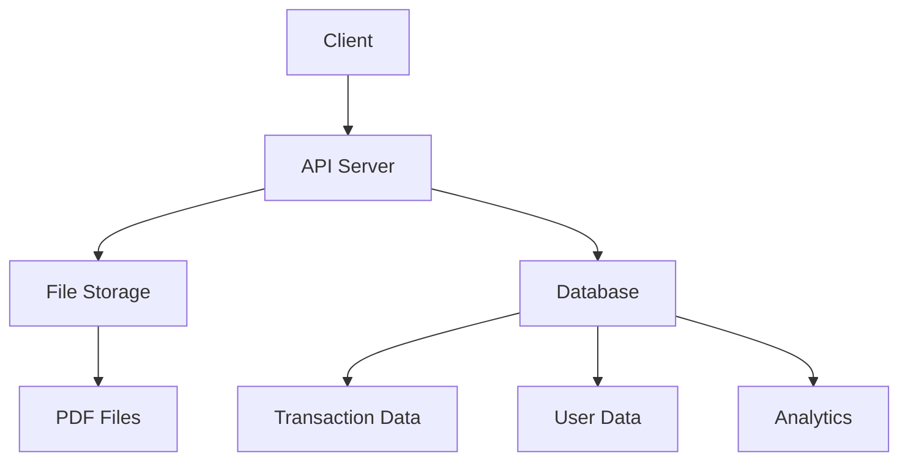

# Storage Design

## Overview

The storage system is designed to securely store and manage bank statements, transactions, and user data. It uses a combination of file storage for PDFs and a relational database for structured data.



## File Storage

### 1. Directory Structure

```
storage/
├── statements/
│   ├── federal/
│   │   └── YYYY-MM/
│   │       └── statement_id.pdf
│   ├── hdfc_savings/
│   └── hdfc_credit/
├── temp/
│   └── uploads/
└── backups/
```

### 2. File Naming Convention

```python
def generate_filename(statement_id: str, 
                     bank: str, 
                     date: datetime) -> str:
    """Generate secure filename for statement"""
    year_month = date.strftime("%Y-%m")
    safe_id = secure_filename(statement_id)
    return f"{year_month}/{safe_id}.pdf"
```

### 3. File Security

```python
class SecureFileStorage:
    def __init__(self, base_path: str):
        self.base_path = base_path
        
    def save_file(self, 
                  file_data: bytes,
                  bank: str,
                  statement_id: str) -> str:
        """Save file with encryption"""
        # Generate secure path
        path = self._generate_path(bank, statement_id)
        
        # Encrypt file
        encrypted_data = self._encrypt_file(file_data)
        
        # Save with restricted permissions
        with open(path, 'wb', 0o600) as f:
            f.write(encrypted_data)
        
        return path
    
    def _encrypt_file(self, data: bytes) -> bytes:
        """Encrypt file data"""
        key = get_encryption_key()
        cipher = Fernet(key)
        return cipher.encrypt(data)
```

## Database Schema

### 1. Users Table

```sql
CREATE TABLE users (
    id UUID PRIMARY KEY,
    email VARCHAR(255) UNIQUE NOT NULL,
    password_hash VARCHAR(255) NOT NULL,
    created_at TIMESTAMP NOT NULL DEFAULT NOW(),
    last_login TIMESTAMP,
    settings JSONB
);

CREATE INDEX idx_users_email ON users(email);
```

### 2. Statements Table

```sql
CREATE TABLE statements (
    id UUID PRIMARY KEY,
    user_id UUID NOT NULL REFERENCES users(id),
    bank VARCHAR(50) NOT NULL,
    account_type VARCHAR(50) NOT NULL,
    file_path VARCHAR(255) NOT NULL,
    upload_date TIMESTAMP NOT NULL DEFAULT NOW(),
    statement_date DATE NOT NULL,
    status VARCHAR(20) NOT NULL,
    metadata JSONB,
    
    CONSTRAINT valid_status CHECK (
        status IN ('processing', 'completed', 'failed')
    )
);

CREATE INDEX idx_statements_user ON statements(user_id);
CREATE INDEX idx_statements_date ON statements(statement_date);
```

### 3. Transactions Table

```sql
CREATE TABLE transactions (
    id UUID PRIMARY KEY,
    statement_id UUID NOT NULL REFERENCES statements(id),
    date DATE NOT NULL,
    description TEXT NOT NULL,
    amount DECIMAL(12,2) NOT NULL,
    type VARCHAR(10) NOT NULL,
    category VARCHAR(50),
    balance DECIMAL(12,2),
    metadata JSONB,
    
    CONSTRAINT valid_type CHECK (
        type IN ('credit', 'debit')
    )
);

CREATE INDEX idx_transactions_statement 
    ON transactions(statement_id);
CREATE INDEX idx_transactions_date 
    ON transactions(date);
CREATE INDEX idx_transactions_category 
    ON transactions(category);
```

### 4. Categories Table

```sql
CREATE TABLE categories (
    id UUID PRIMARY KEY,
    user_id UUID NOT NULL REFERENCES users(id),
    name VARCHAR(50) NOT NULL,
    type VARCHAR(10) NOT NULL,
    parent_id UUID REFERENCES categories(id),
    rules JSONB,
    
    CONSTRAINT valid_type CHECK (
        type IN ('income', 'expense')
    ),
    UNIQUE (user_id, name)
);

CREATE INDEX idx_categories_user ON categories(user_id);
```

## Data Access Layer

### 1. Base Repository

```python
class BaseRepository:
    def __init__(self, db_pool):
        self.db_pool = db_pool
    
    async def execute(self, query: str, *args) -> Any:
        """Execute database query"""
        async with self.db_pool.acquire() as conn:
            async with conn.transaction():
                return await conn.execute(query, *args)
    
    async def fetch(self, query: str, *args) -> List[Record]:
        """Fetch multiple records"""
        async with self.db_pool.acquire() as conn:
            return await conn.fetch(query, *args)
```

### 2. Transaction Repository

```python
class TransactionRepository(BaseRepository):
    async def save_transactions(self,
                              statement_id: str,
                              transactions: List[Dict]) -> None:
        """Save transactions in batch"""
        query = """
            INSERT INTO transactions (
                id, statement_id, date, description,
                amount, type, category, balance, metadata
            )
            VALUES ($1, $2, $3, $4, $5, $6, $7, $8, $9)
        """
        
        async with self.db_pool.acquire() as conn:
            async with conn.transaction():
                await conn.executemany(
                    query,
                    [
                        (
                            str(uuid.uuid4()),
                            statement_id,
                            t['date'],
                            t['description'],
                            t['amount'],
                            t['type'],
                            t.get('category'),
                            t.get('balance'),
                            json.dumps(t.get('metadata', {}))
                        )
                        for t in transactions
                    ]
                )
    
    async def get_transactions(self,
                             filters: Dict,
                             page: int = 1,
                             per_page: int = 50) -> Tuple[List[Dict], int]:
        """Get transactions with pagination"""
        where_clause, params = self._build_filters(filters)
        
        # Get total count
        count_query = f"""
            SELECT COUNT(*) FROM transactions
            WHERE {where_clause}
        """
        total = await self.fetch_val(count_query, *params)
        
        # Get paginated results
        query = f"""
            SELECT * FROM transactions
            WHERE {where_clause}
            ORDER BY date DESC
            LIMIT $1 OFFSET $2
        """
        offset = (page - 1) * per_page
        rows = await self.fetch(
            query, 
            *params, 
            per_page, 
            offset
        )
        
        return [dict(row) for row in rows], total
```

### 3. Statement Repository

```python
class StatementRepository(BaseRepository):
    async def save_statement(self,
                           user_id: str,
                           bank: str,
                           file_path: str,
                           metadata: Dict) -> str:
        """Save statement details"""
        statement_id = str(uuid.uuid4())
        
        query = """
            INSERT INTO statements (
                id, user_id, bank, account_type,
                file_path, statement_date, status, metadata
            )
            VALUES ($1, $2, $3, $4, $5, $6, $7, $8)
            RETURNING id
        """
        
        await self.execute(
            query,
            statement_id,
            user_id,
            bank,
            metadata['account_type'],
            file_path,
            metadata['statement_date'],
            'processing',
            json.dumps(metadata)
        )
        
        return statement_id
```

## Caching Strategy

### 1. Redis Configuration

```python
class CacheConfig:
    REDIS_URL = "redis://localhost:6379/0"
    
    # Cache TTL (in seconds)
    TTL = {
        'transaction': 3600,  # 1 hour
        'statement': 3600,
        'analytics': 1800,    # 30 minutes
        'user': 300          # 5 minutes
    }
```

### 2. Cache Implementation

```python
class TransactionCache:
    def __init__(self, redis_client):
        self.redis = redis_client
    
    async def get_transactions(self,
                             statement_id: str) -> Optional[List[Dict]]:
        """Get cached transactions"""
        key = f"transactions:{statement_id}"
        data = await self.redis.get(key)
        
        if data:
            return json.loads(data)
        return None
    
    async def cache_transactions(self,
                               statement_id: str,
                               transactions: List[Dict]) -> None:
        """Cache transactions"""
        key = f"transactions:{statement_id}"
        await self.redis.setex(
            key,
            CacheConfig.TTL['transaction'],
            json.dumps(transactions)
        )
    
    async def invalidate(self, statement_id: str) -> None:
        """Invalidate cache"""
        key = f"transactions:{statement_id}"
        await self.redis.delete(key)
```

## Backup Strategy

### 1. Database Backup

```python
class DatabaseBackup:
    def __init__(self, config: Dict):
        self.config = config
    
    async def create_backup(self) -> str:
        """Create database backup"""
        timestamp = datetime.now().strftime("%Y%m%d_%H%M%S")
        filename = f"backup_{timestamp}.sql"
        
        cmd = [
            'pg_dump',
            '-h', self.config['host'],
            '-U', self.config['user'],
            '-d', self.config['database'],
            '-f', f"backups/{filename}"
        ]
        
        process = await asyncio.create_subprocess_exec(
            *cmd,
            env={'PGPASSWORD': self.config['password']}
        )
        
        await process.wait()
        return filename
```

### 2. File Backup

```python
class FileBackup:
    def __init__(self, storage_path: str):
        self.storage_path = storage_path
    
    async def backup_statements(self, 
                              destination: str) -> None:
        """Backup statement files"""
        # Create backup directory
        os.makedirs(destination, exist_ok=True)
        
        # Copy files with structure
        for root, _, files in os.walk(self.storage_path):
            for file in files:
                if not file.endswith('.pdf'):
                    continue
                
                src = os.path.join(root, file)
                rel_path = os.path.relpath(
                    src, 
                    self.storage_path
                )
                dst = os.path.join(destination, rel_path)
                
                # Create destination directory
                os.makedirs(
                    os.path.dirname(dst), 
                    exist_ok=True
                )
                
                # Copy file
                shutil.copy2(src, dst)
```

## Security Measures

### 1. File Encryption

```python
class FileEncryption:
    def __init__(self, key_path: str):
        self.key = self._load_key(key_path)
        self.cipher = Fernet(self.key)
    
    def encrypt_file(self, 
                    input_path: str, 
                    output_path: str) -> None:
        """Encrypt file"""
        with open(input_path, 'rb') as f:
            data = f.read()
        
        encrypted_data = self.cipher.encrypt(data)
        
        with open(output_path, 'wb') as f:
            f.write(encrypted_data)
    
    def decrypt_file(self,
                    input_path: str,
                    output_path: str) -> None:
        """Decrypt file"""
        with open(input_path, 'rb') as f:
            encrypted_data = f.read()
        
        decrypted_data = self.cipher.decrypt(encrypted_data)
        
        with open(output_path, 'wb') as f:
            f.write(decrypted_data)
```

### 2. Data Masking

```python
class DataMasking:
    @staticmethod
    def mask_account_number(number: str) -> str:
        """Mask account number"""
        if not number:
            return number
        return f"{'*' * (len(number) - 4)}{number[-4:]}"
    
    @staticmethod
    def mask_sensitive_data(data: Dict) -> Dict:
        """Mask sensitive data in dictionary"""
        masked = data.copy()
        
        sensitive_fields = [
            'account_number',
            'card_number',
            'phone',
            'email'
        ]
        
        for field in sensitive_fields:
            if field in masked:
                masked[field] = DataMasking.mask_field(
                    masked[field]
                )
        
        return masked
```

## Performance Optimization

### 1. Batch Processing

```python
class BatchProcessor:
    def __init__(self, batch_size: int = 1000):
        self.batch_size = batch_size
    
    async def process_transactions(self,
                                 transactions: List[Dict],
                                 process_func: Callable) -> None:
        """Process transactions in batches"""
        for i in range(0, len(transactions), self.batch_size):
            batch = transactions[i:i + self.batch_size]
            await process_func(batch)
```

### 2. Query Optimization

```python
class QueryOptimizer:
    @staticmethod
    def optimize_filters(filters: Dict) -> str:
        """Optimize WHERE clause"""
        conditions = []
        
        # Date range optimization
        if 'start_date' in filters:
            conditions.append(
                "date >= DATE_TRUNC('day', $1::timestamp)"
            )
        if 'end_date' in filters:
            conditions.append(
                "date < DATE_TRUNC('day', $2::timestamp) + INTERVAL '1 day'"
            )
        
        # Category optimization
        if 'category' in filters:
            conditions.append(
                "category = ANY($3::varchar[])"
            )
        
        return " AND ".join(conditions)
``` 