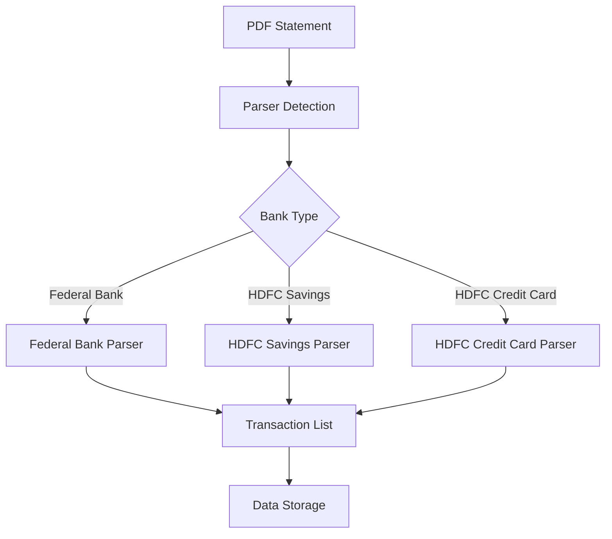

# Bank Statement Parser Architecture

## Overview

The parser system is designed to handle bank statements from multiple banks in PDF format. It uses a modular architecture where each bank has its own specialized parser, but all parsers follow a common interface and share utilities.



## Parser Interface

Each parser implements the following interface:

```python
def detect_statement(pdf_path: str) -> bool:
    """
    Detect if the PDF is from this bank/account type
    Returns True if the parser can handle this statement
    """
    pass

def extract_transactions(pdf_path: str) -> List[Transaction]:
    """
    Extract transactions from the statement
    Returns list of standardized transaction dictionaries
    """
    pass
```

## Transaction Data Model

All parsers output transactions in a standardized format:

```python
Transaction = {
    "date": str,          # Format: "DD/MM/YYYY"
    "description": str,   # Transaction description
    "amount": float,      # Positive for credit, negative for debit
    "type": str,         # "credit" | "debit" | "balance"
    "category": str,     # Transaction category
    "account": str,      # Bank account name
    "account_type": str, # "savings" | "credit"
    "bank": str,         # Bank name
    "account_name": str, # Display name
    "is_debit": bool,    # True for expenses
    "transaction_id": str, # Unique identifier
    "balance": float,    # Running balance
    "sort_key": tuple   # For ordering transactions
}
```

## PDF Processing Strategies

### 1. Text-Based Processing (PyMuPDF)
Used by Federal Bank and HDFC Savings parsers.

```python
def process_text_based(pdf_path: str) -> List[str]:
    doc = fitz.open(pdf_path)
    text_content = []
    for page in doc:
        text = page.get_text()
        lines = text.split('\n')
        text_content.extend(lines)
    return text_content
```

### 2. Table-Based Processing (pdfplumber)
Used by HDFC Credit Card parser.

```python
def process_table_based(pdf_path: str) -> List[List[str]]:
    with pdfplumber.open(pdf_path) as pdf:
        tables = []
        for page in pdf.pages:
            page_tables = page.extract_tables()
            tables.extend(page_tables)
    return tables
```

## Common Processing Steps

1. **Statement Detection**
```python
def detect_statement(text: str, markers: List[str]) -> bool:
    """Check for bank-specific markers in text"""
    score = sum(1 for marker in markers if marker in text)
    return score >= REQUIRED_MARKERS
```

2. **Date Parsing**
```python
def parse_date(date_str: str, year: int) -> str:
    """Convert various date formats to DD/MM/YYYY"""
    formats = [
        "%d/%m/%Y",    # DD/MM/YYYY
        "%d %b",       # DD MMM
        "%d/%m/%y"     # DD/MM/YY
    ]
    for fmt in formats:
        try:
            date = datetime.strptime(date_str, fmt)
            if fmt == "%d %b":
                date = date.replace(year=year)
            return date.strftime("%d/%m/%Y")
        except ValueError:
            continue
    return None
```

3. **Amount Processing**
```python
def process_amount(amount_str: str) -> float:
    """Convert amount string to float"""
    # Remove currency symbols and commas
    clean_amount = re.sub(r'[^\d.-]', '', amount_str)
    return float(clean_amount)
```

## Error Handling

```python
class ParserError(Exception):
    """Base class for parser errors"""
    pass

class StatementDetectionError(ParserError):
    """Error in detecting statement type"""
    pass

class TransactionExtractionError(ParserError):
    """Error in extracting transactions"""
    pass

def safe_parse(func):
    """Decorator for safe parsing operations"""
    @wraps(func)
    def wrapper(*args, **kwargs):
        try:
            return func(*args, **kwargs)
        except Exception as e:
            raise ParserError(f"Error in {func.__name__}: {str(e)}")
    return wrapper
```

## Parser Selection Logic

```python
def select_parser(pdf_path: str) -> BaseParser:
    """Select appropriate parser for the statement"""
    parsers = [
        FederalBankParser(),
        HDFCSavingsParser(),
        HDFCCreditCardParser()
    ]
    
    for parser in parsers:
        if parser.detect_statement(pdf_path):
            return parser
            
    raise StatementDetectionError("No suitable parser found")
```

## Performance Considerations

1. **Memory Management**
   - Process PDF pages sequentially
   - Clean up resources after processing
   - Use context managers for file handling

```python
def process_large_pdf(pdf_path: str) -> Iterator[Transaction]:
    """Memory-efficient processing for large PDFs"""
    with fitz.open(pdf_path) as doc:
        for page_num in range(len(doc)):
            page = doc[page_num]
            transactions = process_page(page)
            yield from transactions
```

2. **Caching**
   - Cache parsed results
   - Store intermediate processing results
   - Reuse common patterns

```python
@lru_cache(maxsize=100)
def get_transaction_pattern(bank: str) -> Pattern:
    """Cache compiled regex patterns"""
    patterns = {
        "federal": r'^(\d{2}\s+[A-Z][a-z]{2})\s+(.+?)\s+([\d,]+\.\d{2})',
        "hdfc": r'^(\d{2}/\d{2}/\d{2})\s+(.+?)\s+([\d,]+\.\d{2})'
    }
    return re.compile(patterns[bank])
```

## Testing Strategy

1. **Unit Tests**
   - Test individual parsing components
   - Validate date parsing
   - Check amount calculations

2. **Integration Tests**
   - Test with real PDF files
   - Verify full parsing pipeline
   - Validate transaction data

```python
def test_parser_pipeline():
    """Integration test for parser pipeline"""
    pdf_path = "tests/data/sample_statement.pdf"
    parser = select_parser(pdf_path)
    transactions = parser.extract_transactions(pdf_path)
    
    assert len(transactions) > 0
    validate_transactions(transactions)
```

## Future Improvements

1. **Machine Learning Integration**
   - Pattern recognition for transaction types
   - Automatic categorization
   - Anomaly detection

2. **Enhanced PDF Processing**
   - Support for scanned documents
   - OCR integration
   - Handle corrupted PDFs

3. **Performance Optimization**
   - Parallel processing
   - Incremental parsing
   - Batch processing 