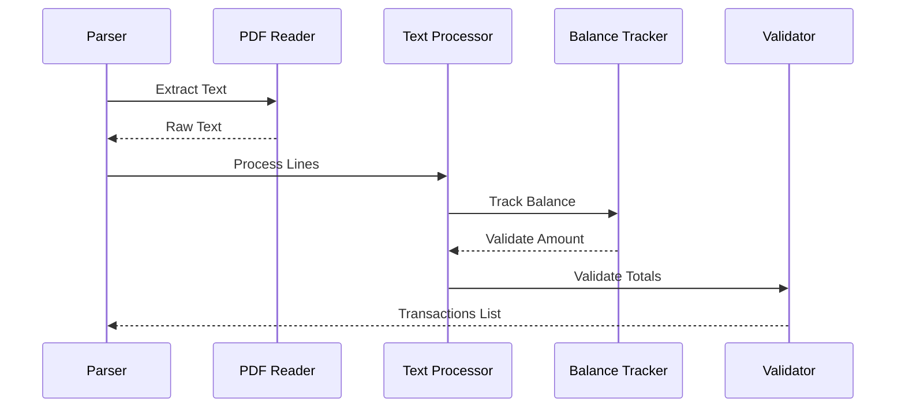

# Federal Bank Statement Parser

## Overview

The Federal Bank statement parser is designed to extract transaction data from Federal Bank PDF statements. It uses PyMuPDF (fitz) for text extraction and implements sophisticated pattern matching to identify and categorize transactions.



## Implementation Details

### 1. Statement Detection

```python
class FederalBankParser:
    def __init__(self):
        self.bank_markers = [
            "FEDERAL BANK",
            "Statement of Account",
            "Branch:",
            "Account Number:"
        ]
    
    def detect_statement(self, pdf_path: str) -> bool:
        """Detect if PDF is a Federal Bank statement"""
        doc = fitz.open(pdf_path)
        first_page = doc[0].get_text()
        
        marker_count = sum(1 for marker in self.bank_markers 
                         if marker in first_page)
        return marker_count >= 3
```

### 2. Transaction Patterns

The parser uses multiple regex patterns to match different transaction formats:

```python
TRANSACTION_PATTERNS = {
    'standard': r'^(\d{2}\s+[A-Z][a-z]{2})\s+(.+?)\s+([\d,]+\.\d{2})',
    'transfer': r'(TRANSFER|NEFT|IMPS|UPI).*?(?:Rs\.|INR)\s*([\d,]+\.\d{2})',
    'atm': r'(ATM/\s*\d+/\s*\d+).*?([\d,]+\.\d{2})',
    'balance': r'Balance\s*(?:Brought|Carried)\s*Forward.*?([\d,]+\.\d{2})'
}
```

### 3. Date Handling

```python
def parse_date(self, date_str: str, year: int) -> str:
    """Convert date string to standard format"""
    # Federal Bank format: "DD MMM"
    day, month = date_str.strip().split()
    month_num = {
        'Jan': 1, 'Feb': 2, 'Mar': 3, 'Apr': 4,
        'May': 5, 'Jun': 6, 'Jul': 7, 'Aug': 8,
        'Sep': 9, 'Oct': 10, 'Nov': 11, 'Dec': 12
    }[month]
    
    return f"{int(day):02d}/{month_num:02d}/{year}"
```

### 4. Balance Tracking

```python
class BalanceTracker:
    def __init__(self, opening_balance: float):
        self.current_balance = opening_balance
        self.transactions = []
    
    def process_transaction(self, amount: float, 
                          current_balance: float) -> str:
        """Determine transaction type based on balance change"""
        if current_balance > self.current_balance:
            transaction_type = 'credit'
        else:
            transaction_type = 'debit'
            amount = -amount
            
        self.current_balance = current_balance
        return transaction_type
```

### 5. Main Extraction Logic

```python
def extract_transactions(self, pdf_path: str) -> List[Dict]:
    """Extract transactions from Federal Bank statement"""
    doc = fitz.open(pdf_path)
    transactions = []
    balance_tracker = None
    
    for page_num in range(len(doc)):
        page = doc[page_num]
        text = page.get_text()
        lines = text.split('\n')
        
        for line in lines:
            # Skip header lines
            if self._is_header_line(line):
                continue
            
            # Extract transaction details
            match = self._match_transaction_pattern(line)
            if not match:
                continue
            
            date_str, description, amount_str = match.groups()
            amount = self._parse_amount(amount_str)
            
            # Initialize balance tracker with opening balance
            if balance_tracker is None:
                opening_balance = self._extract_opening_balance(text)
                balance_tracker = BalanceTracker(opening_balance)
            
            # Process transaction
            transaction = {
                'date': self.parse_date(date_str, self.statement_year),
                'description': description.strip(),
                'amount': amount,
                'type': balance_tracker.process_transaction(
                    amount, self._extract_balance(line)
                ),
                'balance': balance_tracker.current_balance
            }
            transactions.append(transaction)
    
    return self._validate_transactions(transactions)
```

### 6. Amount Processing

```python
def _parse_amount(self, amount_str: str) -> float:
    """Convert amount string to float"""
    # Remove currency symbols and commas
    clean_amount = re.sub(r'[^\d.-]', '', amount_str)
    return float(clean_amount)

def _extract_balance(self, line: str) -> float:
    """Extract balance from transaction line"""
    balance_match = re.search(r'(\d+,?)+\.\d{2}$', line)
    if balance_match:
        return self._parse_amount(balance_match.group())
    return None
```

### 7. Validation

```python
def _validate_transactions(self, transactions: List[Dict]) -> List[Dict]:
    """Validate extracted transactions"""
    # Calculate totals
    credits = sum(t['amount'] for t in transactions 
                 if t['type'] == 'credit')
    debits = sum(abs(t['amount']) for t in transactions 
                if t['type'] == 'debit')
    
    # Extract statement totals
    statement_credits = self._extract_statement_total('credit')
    statement_debits = self._extract_statement_total('debit')
    
    # Validate totals
    if not math.isclose(credits, statement_credits, rel_tol=1e-9):
        raise ValueError("Credit total mismatch")
    if not math.isclose(debits, statement_debits, rel_tol=1e-9):
        raise ValueError("Debit total mismatch")
    
    return transactions
```

## Usage Example

```python
def process_statement(pdf_path: str) -> List[Dict]:
    """Process Federal Bank statement"""
    parser = FederalBankParser()
    
    # Verify statement type
    if not parser.detect_statement(pdf_path):
        raise ValueError("Not a Federal Bank statement")
    
    try:
        # Extract transactions
        transactions = parser.extract_transactions(pdf_path)
        
        # Add metadata
        for transaction in transactions:
            transaction.update({
                'bank': 'Federal Bank',
                'account_type': 'savings',
                'transaction_id': str(uuid.uuid4())
            })
        
        return transactions
        
    except Exception as e:
        logging.error(f"Error processing statement: {str(e)}")
        raise
```

## Error Handling

```python
class FederalBankParserError(Exception):
    """Base class for Federal Bank parser errors"""
    pass

class BalanceError(FederalBankParserError):
    """Error in balance calculation"""
    pass

class ValidationError(FederalBankParserError):
    """Error in transaction validation"""
    pass

def safe_parse(func):
    """Decorator for safe parsing operations"""
    @wraps(func)
    def wrapper(*args, **kwargs):
        try:
            return func(*args, **kwargs)
        except Exception as e:
            raise FederalBankParserError(
                f"Error in {func.__name__}: {str(e)}"
            )
    return wrapper
```

## Performance Optimization

1. **Pattern Compilation**
```python
def __init__(self):
    self.patterns = {
        name: re.compile(pattern) 
        for name, pattern in TRANSACTION_PATTERNS.items()
    }
```

2. **Memory Management**
```python
def process_large_statement(self, pdf_path: str) -> Iterator[Dict]:
    """Process large statements with memory efficiency"""
    doc = fitz.open(pdf_path)
    for page_num in range(len(doc)):
        page = doc[page_num]
        yield from self._process_page(page)
```

3. **Caching**
```python
@lru_cache(maxsize=100)
def _get_transaction_type(self, description: str) -> str:
    """Cached transaction type detection"""
    for pattern, type_ in self.type_patterns.items():
        if pattern.search(description):
            return type_
    return 'unknown'
```

## Testing

```python
class TestFederalBankParser(unittest.TestCase):
    def setUp(self):
        self.parser = FederalBankParser()
        self.sample_pdf = "tests/data/federal_sample.pdf"
    
    def test_statement_detection(self):
        self.assertTrue(
            self.parser.detect_statement(self.sample_pdf)
        )
    
    def test_transaction_extraction(self):
        transactions = self.parser.extract_transactions(
            self.sample_pdf
        )
        self.assertGreater(len(transactions), 0)
        
        # Validate transaction format
        for transaction in transactions:
            self.assertIn('date', transaction)
            self.assertIn('amount', transaction)
            self.assertIn('type', transaction)
            self.assertIn('balance', transaction)
    
    def test_balance_tracking(self):
        transactions = self.parser.extract_transactions(
            self.sample_pdf
        )
        balances = [t['balance'] for t in transactions]
        
        # Check balance continuity
        for i in range(1, len(balances)):
            self.assertAlmostEqual(
                balances[i] - balances[i-1],
                transactions[i]['amount']
            )
``` 