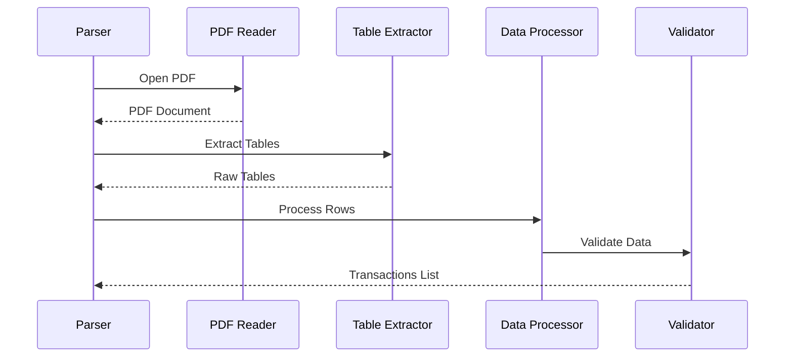

# HDFC Credit Card Parser

## Overview

The HDFC Credit Card parser extracts transaction data from HDFC Bank credit card statements. It uses pdfplumber for table extraction and treats all transactions as expenses by default.



## Implementation Details

### 1. Statement Detection

```python
class HDFCCreditCardParser:
    def __init__(self):
        self.bank_markers = [
            "HDFC Bank Credit Card",
            "Statement Date:",
            "Card Number:",
            "Credit Limit:"
        ]
    
    def detect_statement(self, pdf_path: str) -> bool:
        """Detect if PDF is an HDFC credit card statement"""
        with pdfplumber.open(pdf_path) as pdf:
            first_page = pdf.pages[0]
            text = first_page.extract_text()
            
            marker_count = sum(1 for marker in self.bank_markers 
                             if marker in text)
            return marker_count >= 3
```

### 2. Table Structure

```python
TABLE_SETTINGS = {
    'vertical_strategy': 'text',
    'horizontal_strategy': 'text',
    'min_words_vertical': 3,
    'min_words_horizontal': 2,
    'snap_tolerance': 3,
    'join_tolerance': 3,
    'edge_min_length': 3
}

COLUMN_MAPPINGS = {
    'Date': 'date',
    'Transaction Details': 'description',
    'Amount (₹)': 'amount',
    'Points Earned': 'rewards'
}
```

### 3. Date Handling

```python
def parse_date(self, date_str: str) -> str:
    """Convert date string to standard format"""
    # HDFC CC format: "DD/MM/YYYY" or "DD MMM YYYY"
    try:
        # Try DD/MM/YYYY format
        day, month, year = date_str.split('/')
        return f"{day}/{month}/{year}"
    except ValueError:
        # Try DD MMM YYYY format
        date_obj = datetime.strptime(date_str, "%d %b %Y")
        return date_obj.strftime("%d/%m/%Y")
```

### 4. Table Extraction

```python
def extract_tables(self, pdf_path: str) -> List[List[str]]:
    """Extract tables from credit card statement"""
    tables = []
    with pdfplumber.open(pdf_path) as pdf:
        for page in pdf.pages:
            # Find transaction table
            table = page.extract_table(table_settings=self.TABLE_SETTINGS)
            if table and self._is_transaction_table(table):
                tables.extend(table[1:])  # Skip header row
    return tables

def _is_transaction_table(self, table: List[List[str]]) -> bool:
    """Check if table contains transactions"""
    if not table or len(table) < 2:  # Need header + data
        return False
    
    header = table[0]
    required_columns = {'Date', 'Transaction Details', 'Amount'}
    found_columns = {col.strip() for col in header if col}
    
    return required_columns.issubset(found_columns)
```

### 5. Main Extraction Logic

```python
def extract_transactions(self, pdf_path: str) -> List[Dict]:
    """Extract transactions from HDFC credit card statement"""
    tables = self.extract_tables(pdf_path)
    transactions = []
    
    for row in tables:
        if not row or len(row) < 3:  # Need date, description, amount
            continue
        
        date_str = row[0].strip()
        description = row[1].strip()
        amount_str = row[2].strip()
        
        if not all([date_str, description, amount_str]):
            continue
        
        try:
            transaction = {
                'date': self.parse_date(date_str),
                'description': description,
                'amount': -self._parse_amount(amount_str),  # Negative for expenses
                'type': 'debit',  # All transactions are debits
                'rewards': self._parse_rewards(row[3]) if len(row) > 3 else 0
            }
            transactions.append(transaction)
        except (ValueError, IndexError) as e:
            logging.warning(f"Error processing row: {row}, Error: {str(e)}")
            continue
    
    return self._validate_transactions(transactions)
```

### 6. Amount Processing

```python
def _parse_amount(self, amount_str: str) -> float:
    """Convert amount string to float"""
    # Remove currency symbols, commas, and spaces
    clean_amount = re.sub(r'[^\d.-]', '', amount_str)
    return float(clean_amount)

def _parse_rewards(self, rewards_str: str) -> int:
    """Convert rewards points string to integer"""
    if not rewards_str or rewards_str.strip() == '-':
        return 0
    return int(re.sub(r'[^\d]', '', rewards_str))
```

### 7. Validation

```python
def _validate_transactions(self, transactions: List[Dict]) -> List[Dict]:
    """Validate extracted transactions"""
    if not transactions:
        raise ValidationError("No transactions found in statement")
    
    # Validate date order
    dates = [datetime.strptime(t['date'], "%d/%m/%Y") 
             for t in transactions]
    if dates != sorted(dates):
        raise ValidationError("Transactions not in chronological order")
    
    # Validate amounts
    total_spend = sum(abs(t['amount']) for t in transactions)
    statement_total = self._extract_statement_total()
    
    if not math.isclose(total_spend, statement_total, rel_tol=1e-9):
        raise ValidationError(
            f"Total mismatch: {total_spend} != {statement_total}"
        )
    
    return transactions
```

## Usage Example

```python
def process_statement(pdf_path: str) -> List[Dict]:
    """Process HDFC credit card statement"""
    parser = HDFCCreditCardParser()
    
    # Verify statement type
    if not parser.detect_statement(pdf_path):
        raise ValueError("Not an HDFC credit card statement")
    
    try:
        # Extract transactions
        transactions = parser.extract_transactions(pdf_path)
        
        # Add metadata
        for transaction in transactions:
            transaction.update({
                'bank': 'HDFC Bank',
                'account_type': 'credit_card',
                'transaction_id': str(uuid.uuid4())
            })
        
        return transactions
        
    except Exception as e:
        logging.error(f"Error processing statement: {str(e)}")
        raise
```

## Error Handling

```python
class HDFCCreditCardParserError(Exception):
    """Base class for HDFC credit card parser errors"""
    pass

class TableExtractionError(HDFCCreditCardParserError):
    """Error in table extraction"""
    pass

class ValidationError(HDFCCreditCardParserError):
    """Error in transaction validation"""
    pass

def safe_parse(func):
    """Decorator for safe parsing operations"""
    @wraps(func)
    def wrapper(*args, **kwargs):
        try:
            return func(*args, **kwargs)
        except Exception as e:
            raise HDFCCreditCardParserError(
                f"Error in {func.__name__}: {str(e)}"
            )
    return wrapper
```

## Testing

```python
class TestHDFCCreditCardParser(unittest.TestCase):
    def setUp(self):
        self.parser = HDFCCreditCardParser()
        self.sample_pdf = "tests/data/hdfc_cc_sample.pdf"
    
    def test_statement_detection(self):
        self.assertTrue(
            self.parser.detect_statement(self.sample_pdf)
        )
    
    def test_table_extraction(self):
        tables = self.parser.extract_tables(self.sample_pdf)
        self.assertGreater(len(tables), 0)
        
        # Validate table structure
        for row in tables:
            self.assertEqual(len(row), 4)  # Date, Description, Amount, Rewards
    
    def test_transaction_extraction(self):
        transactions = self.parser.extract_transactions(
            self.sample_pdf
        )
        self.assertGreater(len(transactions), 0)
        
        # Validate transaction format
        for transaction in transactions:
            self.assertIn('date', transaction)
            self.assertIn('amount', transaction)
            self.assertLess(transaction['amount'], 0)  # All amounts are negative
            self.assertEqual(transaction['type'], 'debit')
    
    def test_rewards_parsing(self):
        self.assertEqual(self.parser._parse_rewards("100"), 100)
        self.assertEqual(self.parser._parse_rewards("-"), 0)
        self.assertEqual(self.parser._parse_rewards(""), 0)
```

## Performance Considerations

1. **Memory Management**
```python
def process_large_statement(self, pdf_path: str) -> Iterator[Dict]:
    """Process large statements with memory efficiency"""
    with pdfplumber.open(pdf_path) as pdf:
        for page in pdf.pages:
            table = page.extract_table(
                table_settings=self.TABLE_SETTINGS
            )
            if table and self._is_transaction_table(table):
                for row in table[1:]:  # Skip header
                    yield self._process_row(row)
```

2. **Table Extraction Optimization**
```python
def optimize_table_settings(self, page) -> Dict:
    """Optimize table extraction settings for page"""
    # Adjust settings based on page layout
    settings = self.TABLE_SETTINGS.copy()
    if self._is_dense_page(page):
        settings.update({
            'snap_tolerance': 2,
            'join_tolerance': 2
        })
    return settings
```

3. **Caching**
```python
@lru_cache(maxsize=100)
def _get_date_format(self, date_str: str) -> str:
    """Cached date format detection"""
    if '/' in date_str:
        return "%d/%m/%Y"
    return "%d %b %Y"
``` 