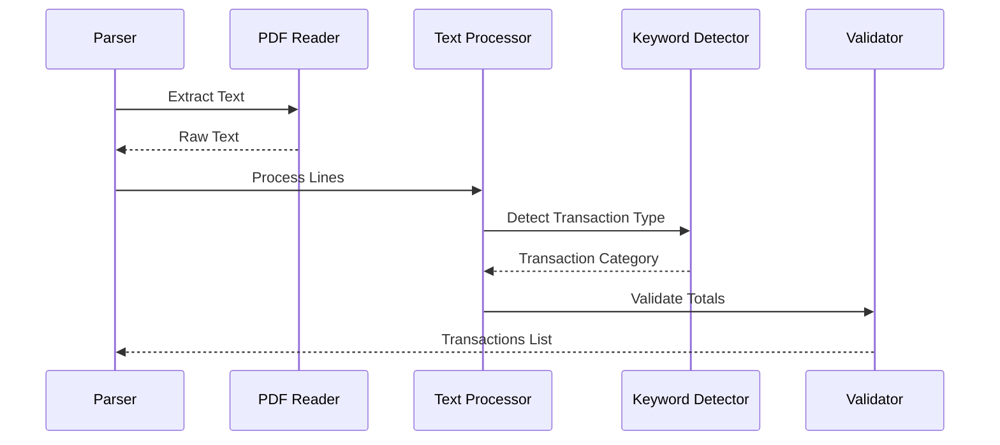

# HDFC Savings Account Parser

## Overview

The HDFC Savings Account parser extracts transaction data from HDFC Bank savings account statements. It uses PyMuPDF for text extraction and implements keyword-based transaction type detection.



## Implementation Details

### 1. Statement Detection

```python
class HDFCSavingsParser:
    def __init__(self):
        self.bank_markers = [
            "HDFC BANK LIMITED",
            "Savings Account Statement",
            "Branch:",
            "Account No:"
        ]
    
    def detect_statement(self, pdf_path: str) -> bool:
        """Detect if PDF is an HDFC savings account statement"""
        doc = fitz.open(pdf_path)
        first_page = doc[0].get_text()
        
        marker_count = sum(1 for marker in self.bank_markers 
                         if marker in first_page)
        return marker_count >= 3
```

### 2. Transaction Patterns

```python
TRANSACTION_PATTERNS = {
    'standard': r'^(\d{2}/\d{2}/\d{2})\s+(.+?)\s+([\d,]+\.\d{2})',
    'upi': r'UPI-.*?-([A-Z0-9]+)',
    'neft': r'NEFT-.*?-([A-Z0-9]+)',
    'imps': r'IMPS-.*?-([A-Z0-9]+)',
    'atm': r'ATM/\d+/\d+'
}

CREDIT_KEYWORDS = [
    'CREDIT', 'DEPOSIT', 'SALARY', 'INTEREST', 'REFUND'
]

DEBIT_KEYWORDS = [
    'DEBIT', 'WITHDRAWAL', 'ATM', 'UPI', 'NEFT-DR', 'IMPS-DR'
]
```

### 3. Date Handling

```python
def parse_date(self, date_str: str) -> str:
    """Convert date string to standard format"""
    # HDFC format: "DD/MM/YY"
    day, month, year = date_str.split('/')
    full_year = f"20{year}" if len(year) == 2 else year
    return f"{day}/{month}/{full_year}"
```

### 4. Transaction Type Detection

```python
def detect_transaction_type(self, description: str) -> str:
    """Determine transaction type based on keywords"""
    description = description.upper()
    
    if any(keyword in description for keyword in self.CREDIT_KEYWORDS):
        return 'credit'
    elif any(keyword in description for keyword in self.DEBIT_KEYWORDS):
        return 'debit'
    else:
        # Use balance-based detection as fallback
        return self._detect_from_balance()
```

### 5. Main Extraction Logic

```python
def extract_transactions(self, pdf_path: str) -> List[Dict]:
    """Extract transactions from HDFC savings statement"""
    doc = fitz.open(pdf_path)
    transactions = []
    
    for page_num in range(len(doc)):
        page = doc[page_num]
        text = page.get_text()
        lines = text.split('\n')
        
        for line in lines:
            # Skip header lines
            if self._is_header_line(line):
                continue
            
            # Extract transaction details
            match = self._match_transaction_pattern(line)
            if not match:
                continue
            
            date_str, description, amount_str = match.groups()
            amount = self._parse_amount(amount_str)
            
            transaction = {
                'date': self.parse_date(date_str),
                'description': description.strip(),
                'amount': amount,
                'type': self.detect_transaction_type(description),
                'balance': self._extract_balance(line)
            }
            transactions.append(transaction)
    
    return self._validate_transactions(transactions)
```

### 6. Amount Processing

```python
def _parse_amount(self, amount_str: str) -> float:
    """Convert amount string to float"""
    # Remove currency symbols and commas
    clean_amount = re.sub(r'[^\d.-]', '', amount_str)
    return float(clean_amount)

def _extract_balance(self, line: str) -> float:
    """Extract balance from transaction line"""
    balance_match = re.search(r'(\d+,?)+\.\d{2}$', line)
    if balance_match:
        return self._parse_amount(balance_match.group())
    return None
```

### 7. Validation

```python
def _validate_transactions(self, transactions: List[Dict]) -> List[Dict]:
    """Validate extracted transactions"""
    # Calculate totals
    credits = sum(t['amount'] for t in transactions 
                 if t['type'] == 'credit')
    debits = sum(abs(t['amount']) for t in transactions 
                if t['type'] == 'debit')
    
    # Extract statement totals
    statement_credits = self._extract_statement_total('credit')
    statement_debits = self._extract_statement_total('debit')
    
    # Validate totals
    if not math.isclose(credits, statement_credits, rel_tol=1e-9):
        raise ValueError("Credit total mismatch")
    if not math.isclose(debits, statement_debits, rel_tol=1e-9):
        raise ValueError("Debit total mismatch")
    
    return transactions
```

## Usage Example

```python
def process_statement(pdf_path: str) -> List[Dict]:
    """Process HDFC savings account statement"""
    parser = HDFCSavingsParser()
    
    # Verify statement type
    if not parser.detect_statement(pdf_path):
        raise ValueError("Not an HDFC savings account statement")
    
    try:
        # Extract transactions
        transactions = parser.extract_transactions(pdf_path)
        
        # Add metadata
        for transaction in transactions:
            transaction.update({
                'bank': 'HDFC Bank',
                'account_type': 'savings',
                'transaction_id': str(uuid.uuid4())
            })
        
        return transactions
        
    except Exception as e:
        logging.error(f"Error processing statement: {str(e)}")
        raise
```

## Error Handling

```python
class HDFCSavingsParserError(Exception):
    """Base class for HDFC savings parser errors"""
    pass

class StatementFormatError(HDFCSavingsParserError):
    """Error in statement format"""
    pass

class ValidationError(HDFCSavingsParserError):
    """Error in transaction validation"""
    pass

def safe_parse(func):
    """Decorator for safe parsing operations"""
    @wraps(func)
    def wrapper(*args, **kwargs):
        try:
            return func(*args, **kwargs)
        except Exception as e:
            raise HDFCSavingsParserError(
                f"Error in {func.__name__}: {str(e)}"
            )
    return wrapper
```

## Testing

```python
class TestHDFCSavingsParser(unittest.TestCase):
    def setUp(self):
        self.parser = HDFCSavingsParser()
        self.sample_pdf = "tests/data/hdfc_savings_sample.pdf"
    
    def test_statement_detection(self):
        self.assertTrue(
            self.parser.detect_statement(self.sample_pdf)
        )
    
    def test_transaction_extraction(self):
        transactions = self.parser.extract_transactions(
            self.sample_pdf
        )
        self.assertGreater(len(transactions), 0)
        
        # Validate transaction format
        for transaction in transactions:
            self.assertIn('date', transaction)
            self.assertIn('amount', transaction)
            self.assertIn('type', transaction)
            self.assertIn('balance', transaction)
    
    def test_transaction_type_detection(self):
        # Test credit detection
        self.assertEqual(
            self.parser.detect_transaction_type("SALARY CREDIT"),
            'credit'
        )
        
        # Test debit detection
        self.assertEqual(
            self.parser.detect_transaction_type("UPI-DR/123456"),
            'debit'
        )
``` 