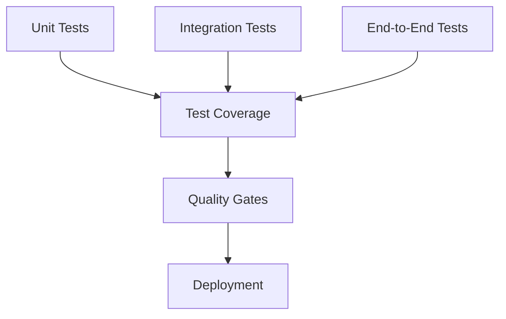

# Testing Strategy

## Overview

This document outlines the testing strategy for the Personal Finance Dashboard application. The testing approach is comprehensive, covering unit tests, integration tests, and end-to-end testing.



## Test Categories

### 1. Unit Tests

Unit tests focus on testing individual components and functions in isolation:

- **Parser Tests**: Verify each bank statement parser works correctly
- **API Tests**: Test individual API endpoints and handlers
- **Model Tests**: Validate data models and transformations
- **Utility Tests**: Test helper functions and utilities

```python
class TestFederalBankParser(unittest.TestCase):
    def setUp(self):
        self.parser = FederalBankParser()
        self.sample_data = load_test_data('federal_bank_sample.pdf')
    
    def test_parse_date(self):
        """Test date parsing logic"""
        test_cases = [
            ('01/04/2024', '01/04/2024'),
            ('1-Apr-2024', '01/04/2024')
        ]
        for input_date, expected in test_cases:
            result = self.parser.parse_date(input_date)
            self.assertEqual(result, expected)
```

### 2. Integration Tests

Integration tests verify that different components work together correctly:

- **Parser Pipeline Tests**: Test complete parsing workflow
- **API Integration Tests**: Test API endpoints with database
- **Authentication Tests**: Test auth flow with API
- **Storage Tests**: Test data persistence and retrieval

```python
class TestParserPipeline(unittest.TestCase):
    def setUp(self):
        self.storage = TestStorage()
        self.pipeline = ParserPipeline(storage=self.storage)
    
    def test_complete_workflow(self):
        """Test complete parsing workflow"""
        # Process statement
        result = self.pipeline.process_statement(
            'test_statement.pdf',
            bank_type='federal'
        )
        
        # Verify storage
        stored_data = self.storage.get_transactions(
            result.statement_id
        )
        self.assertEqual(
            len(stored_data),
            len(result.transactions)
        )
```

### 3. End-to-End Tests

End-to-end tests verify the complete system works as expected:

- **UI Tests**: Test frontend components and interactions
- **API Flow Tests**: Test complete API workflows
- **Data Flow Tests**: Test data processing pipelines
- **Performance Tests**: Test system under load

```python
class TestEndToEnd(unittest.TestCase):
    def setUp(self):
        self.driver = webdriver.Chrome()
        self.app = create_test_app()
        
    def test_statement_upload(self):
        """Test statement upload workflow"""
        # Login
        self.login_user()
        
        # Upload statement
        self.upload_file('test_statement.pdf')
        
        # Verify processing
        self.wait_for_processing()
        
        # Check results
        transactions = self.get_transactions()
        self.assertGreater(len(transactions), 0)
```

## Test Data Management

### 1. Sample Data

```python
SAMPLE_DATA_DIR = 'tests/data'

def load_test_data(filename: str) -> bytes:
    """Load sample test data"""
    path = os.path.join(SAMPLE_DATA_DIR, filename)
    with open(path, 'rb') as f:
        return f.read()

def create_test_statement(bank: str, **kwargs) -> str:
    """Create test statement with specific properties"""
    template = load_template(f"{bank}_template.pdf")
    return fill_template(template, **kwargs)
```

### 2. Mock Objects

```python
class MockStorage:
    """Mock storage for testing"""
    def __init__(self):
        self.data = {}
    
    def save_transactions(self, 
                         statement_id: str, 
                         transactions: List[Dict]) -> None:
        self.data[statement_id] = transactions
    
    def get_transactions(self, statement_id: str) -> List[Dict]:
        return self.data.get(statement_id, [])

class MockParser:
    """Mock parser for testing"""
    def parse(self, data: bytes) -> List[Dict]:
        return [
            {
                'date': '01/04/2024',
                'amount': 1000,
                'description': 'Test Transaction'
            }
        ]
```

## Test Coverage

### 1. Coverage Requirements

- Minimum 90% code coverage for critical components:
  * Parser modules
  * API endpoints
  * Data models
  * Authentication
- Minimum 80% coverage for other components

### 2. Coverage Monitoring

```python
def check_coverage():
    """Check test coverage"""
    coverage = Coverage()
    coverage.start()
    
    # Run tests
    unittest.main()
    
    coverage.stop()
    coverage.save()
    
    # Generate report
    coverage.report(
        include=['src/*', 'parsers/*'],
        show_missing=True
    )
```

## Continuous Integration

### 1. Test Automation

```yaml
# .github/workflows/test.yml
name: Tests
on: [push, pull_request]

jobs:
  test:
    runs-on: ubuntu-latest
    steps:
      - uses: actions/checkout@v2
      - name: Set up Python
        uses: actions/setup-python@v2
        with:
          python-version: '3.9'
      
      - name: Install dependencies
        run: |
          python -m pip install --upgrade pip
          pip install -r requirements.txt
          pip install -r requirements-dev.txt
      
      - name: Run tests
        run: |
          python -m pytest tests/
          coverage run -m pytest
          coverage report
```

### 2. Quality Gates

```python
def check_quality_gates():
    """Check quality gates before deployment"""
    # Check test coverage
    coverage = get_coverage()
    if coverage < 90:
        raise QualityError("Coverage below 90%")
    
    # Check test results
    test_results = run_tests()
    if test_results.failures:
        raise QualityError("Test failures")
    
    # Check performance
    perf_results = run_performance_tests()
    if perf_results.latency > 200:
        raise QualityError("Performance below threshold")
```

## Performance Testing

### 1. Load Tests

```python
def test_parser_performance():
    """Test parser performance under load"""
    parser = FederalBankParser()
    
    # Generate large statement
    large_statement = create_test_statement(
        'federal',
        num_transactions=1000
    )
    
    # Measure parsing time
    start_time = time.time()
    transactions = parser.parse(large_statement)
    end_time = time.time()
    
    parsing_time = end_time - start_time
    assert parsing_time < 5.0  # Should parse within 5 seconds
```

### 2. Stress Tests

```python
def test_concurrent_uploads():
    """Test concurrent statement uploads"""
    num_concurrent = 10
    
    async def upload_statement():
        async with aiohttp.ClientSession() as session:
            await session.post(
                '/api/statements/upload',
                data={'file': create_test_statement('federal')}
            )
    
    # Run concurrent uploads
    loop = asyncio.get_event_loop()
    tasks = [upload_statement() for _ in range(num_concurrent)]
    loop.run_until_complete(asyncio.gather(*tasks))
```

## Security Testing

### 1. Authentication Tests

```python
def test_auth_flow():
    """Test authentication flow"""
    # Test valid login
    response = client.post('/api/auth/login', json={
        'username': 'test_user',
        'password': 'test_pass'
    })
    assert response.status_code == 200
    
    # Test invalid login
    response = client.post('/api/auth/login', json={
        'username': 'test_user',
        'password': 'wrong_pass'
    })
    assert response.status_code == 401
```

### 2. Authorization Tests

```python
def test_statement_access():
    """Test statement access control"""
    # Create test users
    user1 = create_test_user()
    user2 = create_test_user()
    
    # Upload statement as user1
    statement_id = upload_statement(user1)
    
    # Try accessing as user2
    response = get_statement(user2, statement_id)
    assert response.status_code == 403
```

## Test Maintenance

### 1. Test Organization

```
tests/
├── unit/
│   ├── test_parsers.py
│   ├── test_models.py
│   └── test_utils.py
├── integration/
│   ├── test_api.py
│   └── test_storage.py
├── e2e/
│   └── test_workflows.py
└── data/
    └── sample_statements/
```

### 2. Test Utilities

```python
class TestBase:
    """Base class for tests"""
    def setUp(self):
        self.app = create_test_app()
        self.client = self.app.test_client()
        self.storage = MockStorage()
    
    def tearDown(self):
        cleanup_test_data()
    
    def create_test_user(self, **kwargs):
        return create_user(self.app, **kwargs)
    
    def upload_statement(self, user, statement):
        return upload_file(
            self.client,
            '/api/statements/upload',
            statement,
            user=user
        )
``` 